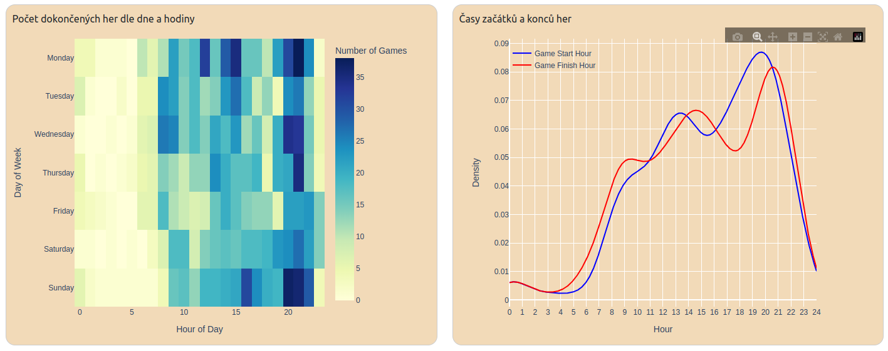
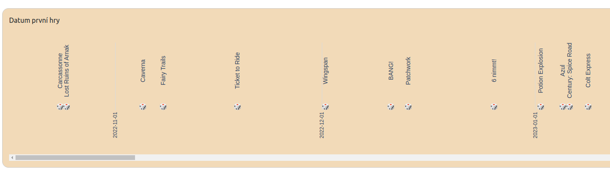
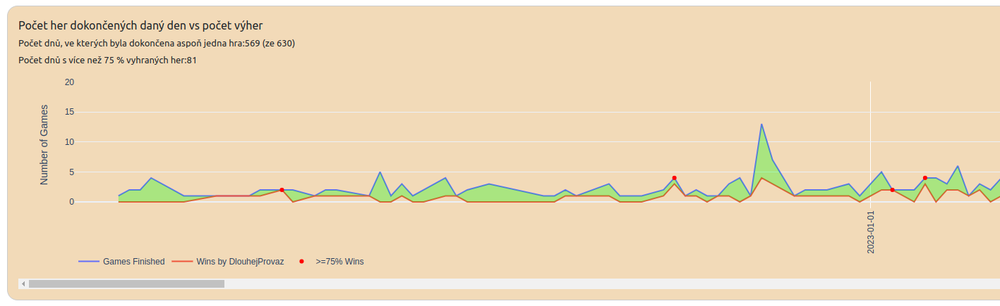
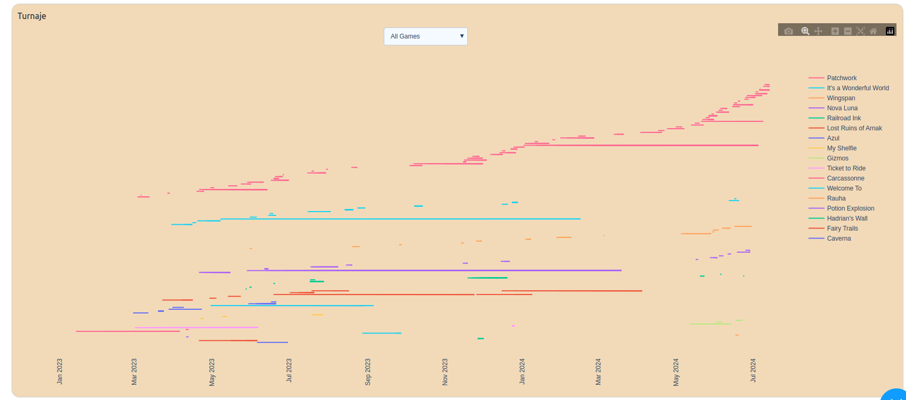
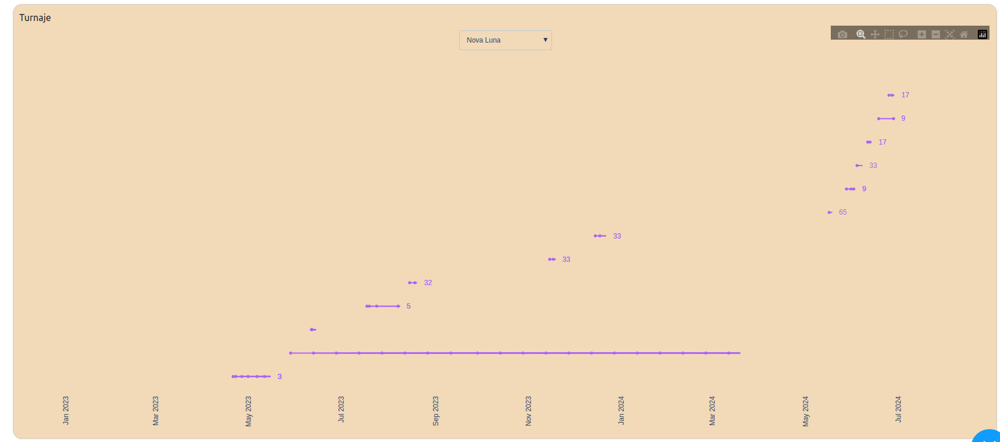

# scraping_board_game_arena
Získání dat konkrétního uživatele BGA, jejich uložení do .csv souborů i lokální PostgreSQL databáze a vytvoření dashboardu pomocí Dash.

Získání informací je rozděleno do několika kroků. 

Pro první aktualizaci spusťte pouze run_scripts.sh (part2 nejde spustit jako headless. Je potřeba ručně odkliknout "Vyberte vyhledávač"). Pro každou další aktualizace spusťte aktualizace.sh a následně run_scripts_aktualizace.sh.

Dashboard se spouští pomocí python3 app_dash.py a potřebuje pouze csv soubory ze složky "aktualizace" a funkcee.py.

[Minutová ukázka](https://github.com/pavlinak7/scraping_board_game_arena/blob/main/ukazka.mkv) 

(Pracuji na zpřehlednění kódu :-))

